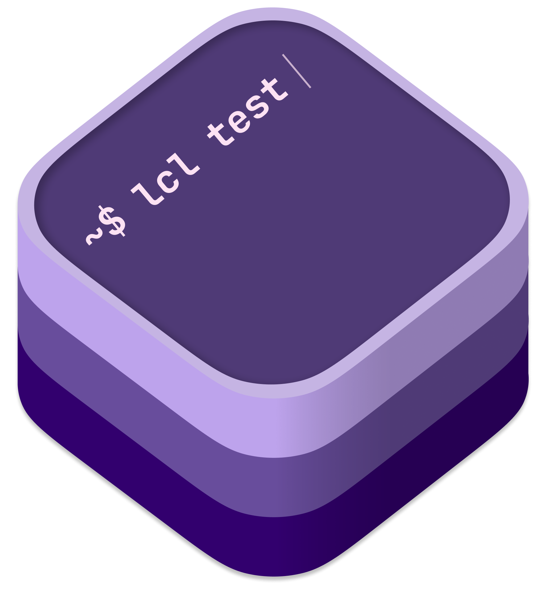

<div align="center">

</div>

---
# LCL CLI
LCL CLI is a cross-platform cli tool written in Swift. It is designed to measure the network performance and latency through LCL's cellular network measurement testbed. While this tool is design for Local Connectivity Lab researchers and Seattle Community Network volunteers and users, everyone is welcome to use this tool to measure their network performance.

## Usage

```
OVERVIEW: A command-line tool from Local Connectivity Lab @UWCSE

USAGE: lcl <subcommand>

OPTIONS:
  -h, --help              Show help information.

SUBCOMMANDS:
  register                Register with SCN server to report test data.
  ping                    Run Ping Latency and Reachability Test.
  speedtest               Run speedtest using the NDT test infrastructure.
  measure                 Run SCN test suite and optionally report the measurement result to SCN.
  interfaces              List available network interfaces on the machine.
  cellular-sites          Get info on SCN cellular sites

  See 'lcl help <subcommand>' for detailed help.
``` 

## Features
- ICMP and HTTP test with `Server-Timing` support.
- Speedtest on top of NDT7 protocol with TCP-level and Application-level measurement
- Automatically upload test result to SCN's backend server (this option is available to SCN users and volunteers).
- Check available interfaces on the machine.

## Platform Support
LCL CLI is designed to support various platforms that Swift supports, including Linux (Debian and Ubuntu), macOS. Those who are interested in other platforms can download and compile the binary from the source. 


## Contributing
Any contribution and pull requests are welcome! However, before you plan to implement some features or try to fix an uncertain issue, it is recommended to open a discussion first. You can also join our [Discord channel](https://discord.com/invite/gn4DKF83bP), or visit our [website](https://seattlecommunitynetwork.org/).

## License
LCL CLI is released under Apache License. See [LICENSE](/LICENSE) for more details.
